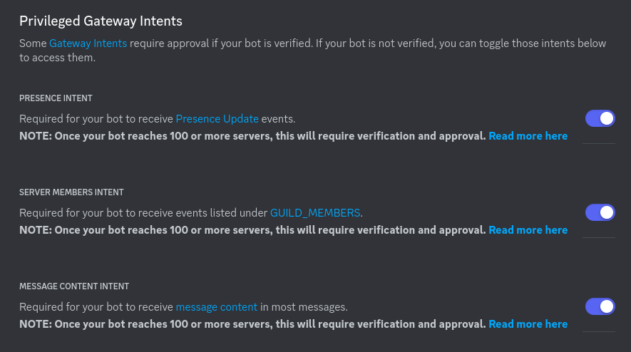
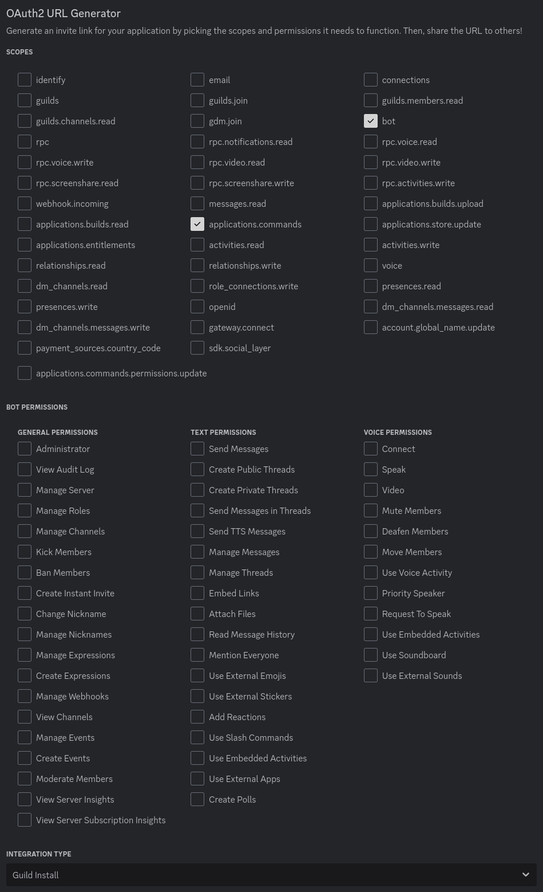

# Creating a bot application

1. [Open the Discord developer portal](https://discord.com/developers/applications).
2. Create a new application in the top right corner.
3. Click add bot in the bot tab.
4. Turn off public status in the bot tab:

5. Turn on all intents in the bot tab: 

4. Generate an invite link in the OAuth2 tab with the following scopes (bot permissions do not matter in this step):

6. Invite the bot using the invite link generated at the bottom.
