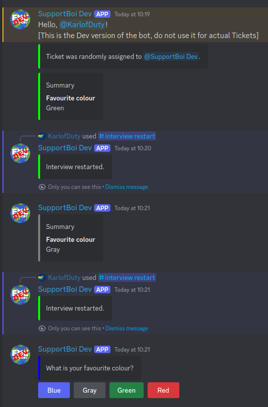

# Writing Interview Templates

The bot can automatically interview users when they open a ticket. These interviews are defined in interview templates.
The templates each apply to a single ticket category so you can have different interviews depending on the type of ticket.

## Interview Template Commands

Whether you already have a template or not the first step is always to use the `/interviewtemplate get <category>` command on the
ticket category you want to edit. If you haven't yet, use the `/addcategory` command on the category to register it with the bot.

The bot will reply with a JSON template file which you can edit and upload using the `/interviewtemplate set` command.

You can also delete an interview template using the `/interviewtemplate delete` command.

## Writing Your First Interview Template

Use the get command to get a default template for the ticket category you want to edit:
```
/interviewtemplate get <category>
```

The bot will reply with a JSON template file for you to edit using your preferred text editor.

**Note:** It is highly recommended to use integrated template validation in your text editor, see below.

When you are done editing it you can upload it to the bot using the set command:
```
/interviewtemplate set <category>
```

The bot will check that your template is correctly formatted and provide feedback if it is not.

## Automatic Template Validation and Suggestions in Text Editors

It is highly recommended to use the interview template JSON schema to get live validation of your template while you write it:

### Guides for Different Editors

<details>

<summary>VS Code</summary>

1. Go to `File->Preferences->Settings`.
2. Search for `json schema`.
3. Click `Edit in settings.json` on the schema setting.
4. Set the `json.schemas` property to the following to automatically validate template files:

```json
{
    "json.schemas":
    [
        {
            "fileMatch":
            [
                "interview-template*.json"
            ],
            "url": "https://raw.githubusercontent.com/KarlOfDuty/SupportBoi/refs/heads/main/Interviews/interview_template.schema.json"
        }
    ]
}
```

5. Open an interview template, you should now get suggestions for things like step types and color names, and error highlighting for any invalid sections.

</details>

<details>

<summary>Jetbrains Editors</summary>

1. Go to `File->Settings->Languages & Frameworks->Schemas->JSON Schema Mapping`.
2. Add a new schema with the following URL: `https://raw.githubusercontent.com/KarlOfDuty/SupportBoi/refs/heads/main/Interviews/interview_template.schema.json`.
   
3. Restart your editor and all interview templates should now automatically be set to the correct schema in the bottom right of the window.

</details>

### Example Usage

 

## Interview Template Format

This section lists all the properties that can be used in an interview template.
If you have set up your editor as suggested above it will handle a lot of this for you automatically.

Here is a simple example of an interview asking a user for their favourite colour out of the different button colours. Two of the options are added as step references and two are normal steps. References are meant to be used when you want to re-use the same step in several places while normal steps are just used in one location.
```json
{
  "category-id": 1006863882301755503,
  "interview":
  {
    "message": "What is your favourite colour?",
    "step-type": "BUTTONS",
    "color": "BLUE",
    "summary-field": "Favourite colour",
    "step-references":
    {
      "Green":
      {
        "id": "green",
        "button-style": "SUCCESS"
      },
      "Red":
      {
        "id": "red",
        "button-style": "DANGER"
      }
    },
    "steps":
    {
      "Blue":
      {
        "message": "Summary",
        "step-type": "INTERVIEW_END",
        "add-summary": true,
        "color": "BLUE",
        "button-style": "PRIMARY",
        "steps": {}
      },
      "Gray":
      {
        "message": "Summary",
        "step-type": "INTERVIEW_END",
        "add-summary": true,
        "color": "GRAY",
        "button-style": "SECONDARY",
        "steps": {}
      }
    }
  },
  "definitions":
  {
    "green":
    {
      "message": "Summary",
      "step-type": "INTERVIEW_END",
      "add-summary": true,
      "color": "GREEN",
      "steps": {}
    },
    "red":
    {
      "message": "Summary",
      "step-type": "INTERVIEW_END",
      "add-summary": true,
      "color": "RED",
      "steps": {}
    }    
  }  
}
```

Here is an example of running the above interview a few times. The config option to delete the questions and answers when the interview ends is on.



### Template Root

| Property&nbsp;&nbsp;&nbsp;&nbsp;&nbsp;&nbsp;&nbsp;&nbsp;&nbsp;&nbsp;&nbsp; | Required | Description                                                                                                                                                                      |
|----------------------------------------------------------------------------|----------|----------------------------------------------------------------------------------------------------------------------------------------------------------------------------------|
| `category-id`                                                              | Yes      | The id of the category this template applies to. You can change this and re-upload the template to apply it to a different category.                                             |
| `interview`                                                                | Yes      | Contains the interview conversation tree, starting with one interview step which branches into many.                                                                             |
| `definitions`                                                              | Yes      | Contains a list of steps which can be referenced in the interview, see example above. These steps can also reference each other or themselves for more advanced interview trees. |

### Interview Steps

<!-- This is an HTML table to allow for markdown formatting inside -->
<table>
  <tbody>
    <tr>
      <th>Property&nbsp;&nbsp;&nbsp;&nbsp;&nbsp;&nbsp;&nbsp;&nbsp;&nbsp;&nbsp;&nbsp;&nbsp;&nbsp;&nbsp;&nbsp;&nbsp;&nbsp;&nbsp;&nbsp;&nbsp;&nbsp;&nbsp;&nbsp;&nbsp;&nbsp;&nbsp;&nbsp;&nbsp;&nbsp;</th>
      <th>Required</th>
      <th>Type</th>
      <th>Description</th>
    </tr>
    <tr>
      <td>
<!-- For whatever reason there must be an empty row here -->

`message`
      </td>
      <td>Yes</td>
      <td>String</td>
      <td>
The text in the embed message that will be sent to the user when they reach this step. Required for all step types except `REFERENCE_END`.
      </td>
    </tr>
    <tr>
      <td>
`step-type`
      </td>
      <td>Yes</td>
      <td>String</td>
      <td>
Decides what the bot will do when the user gets to this step. See the list of step types below for more info.

<!-- For whatever reason this tag cannot be indented -->
</td>
    </tr>
    <tr>
      <td>
<!-- For whatever reason there must be an empty row here -->

`color`
      </td>
      <td>No</td>
      <td>String</td>
      <td>

Colour of the message embed. You can either enter a colour name or a hexadecimal RGB value.
      </td>
    </tr>
    <tr>
      <td>
`steps`
      </td>
      <td>No</td>
      <td>Steps</td>
      <td>
One or more interview steps. The name of the step is used as a regex match against the user's answer,
except for selection boxes and buttons where each step becomes a button or selection option.
      </td>
    </tr>
    <tr>
      <td>
`step-references`
      </td>
      <td>No</td>
      <td>Step References</td>
      <td>
One or more references to steps in the `definitions` property. The name of the step is used as a regex match against the user's answer,
except for selection boxes and buttons where each step becomes a button or selection option.
      </td>
    </tr>
    <tr>
      <td>
`heading`
      </td>
      <td>No</td>
      <td>String</td>
      <td>
The title of the embed message.
      </td>
    </tr>
    <tr>
      <td>
`summary-field`
      </td>
      <td>No</td>
      <td>String</td>
      <td>
When an interview ends all previous answers with this property will be put in a summary.
If this property is not specified the answer will not be shown in the summary.
The value of this property is the name which will be displayed next to the answer in the summary.
      </td>
    </tr>
    <tr>
      <td>
`button-style`
      </td>
      <td>No</td>
      <td>String</td>
      <td>
The style of this step's button. Requires that the parent step is a `BUTTONS` step.
Must be one of the following:

- `PRIMARY`
- `SECONDARY`
- `SUCCESS`
- `DANGER`

Default style is `SECONDARY`.


      </td>
    </tr>
    <tr>
      <td>
`selector-description`
      </td>
      <td>No</td>
      <td>String</td>
      <td>
Description for this option in the parent step's selection box. Requires that the parent step is a `TEXT_SELECTOR`.
      </td>
    </tr>
    <tr>
      <td>
`selector-placeholder`
      </td>
      <td>No</td>
      <td>String</td>
      <td>
The placeholder text shown before a value is selected in the selection box. Requires that this step is a `TEXT_SELECTOR`.
      </td>
    </tr>
    <tr>
      <td>
`max-length`
      </td>
      <td>No</td>
      <td>Number</td>
      <td>
The maximum length of the user's response message. Requires that this step is a `TEXT_INPUT`.
      </td>
    </tr>
    <tr>
      <td>
`min-length`
      </td>
      <td>No</td>
      <td>Number</td>
      <td>
The minimum length of the user's response message. Requires that this step is a `TEXT_INPUT`.
      </td>
    </tr>
    <tr>
      <td>
`add-summary`
      </td>
      <td>No</td>
      <td>Boolean</td>
      <td>
Whether to add a summary of all of the user's answers to this message.
      </td>
    </tr>
    <tr>
      <td>
`answer-delimiter`
      </td>
      <td>No</td>
      <td>String</td>
      <td>
If the user answers several questions with the same `summary-field` the last answer will be used in the summary by default. If you set this parameter all of the answers will be combined using this delimiter instead.
      </td>
    </tr>
  </tbody>
</table>

### Step References

| Property&nbsp;&nbsp;&nbsp;&nbsp;&nbsp;&nbsp;&nbsp;&nbsp;&nbsp;&nbsp;&nbsp; | Required | Description                                                                                                                              |
|----------------------------------------------------------------------------|----------|------------------------------------------------------------------------------------------------------------------------------------------|
| `id`                                                                       | Yes      | The ID of the definition to refer to.                                                                                                    |
| `button-style`                                                             | No       | Same as the `button-style` property in a normal step.                                                                                    |
| `selector-description`                                                     | No       | Same as the `selector-description` property in a normal step.                                                                            |
| `after-reference-step`                                                     | No       | If the step tree you referenced using the `id` ends in a `REFERENCE_END` the interview will continue from here when the user reaches it. |

### Step Types

| Step Type              | Description                                                                                                                                                                    |
|------------------------|--------------------------------------------------------------------------------------------------------------------------------------------------------------------------------|
| `ERROR`                | Sends an error message but does not stop the interview. The interview remains on the same step as before allowing the user to try again.                                       |
| `INTERVIEW_END`        | End the interview and deletes the previous messages if enabled in the config.                                                                                                  |
| `BUTTONS`              | Creates a message with one button per child step where the button text is the name of the child step.                                                                          |
| `TEXT_SELECTOR`        | Creates a selection box with one option per child step where the option text is the name of the child step.                                                                    |
| `USER_SELECTOR`        | Creates a selection box where the user can select a user from the Discord server. The value used for the summary is the user's mention.                                        |
| `ROLE_SELECTOR`        | Same as above but for a role.                                                                                                                                                  |
| `MENTIONABLE_SELECTOR` | Same as above but works for both roles and users.                                                                                                                              |
| `CHANNEL_SELECTOR`     | Same as above but for channels and categories.                                                                                                                                 |
| `TEXT_INPUT`           | Lets the user reply to the bot message with their own text.                                                                                                                    |
| `REFERENCE_END`        | Use this in a reference to go back to the step which used the reference. When the user reaches this step the `after-reference-step` where this reference was used will be run. |
