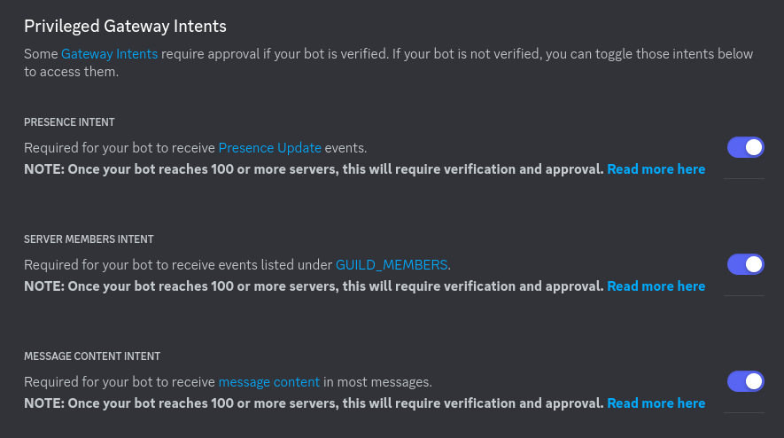
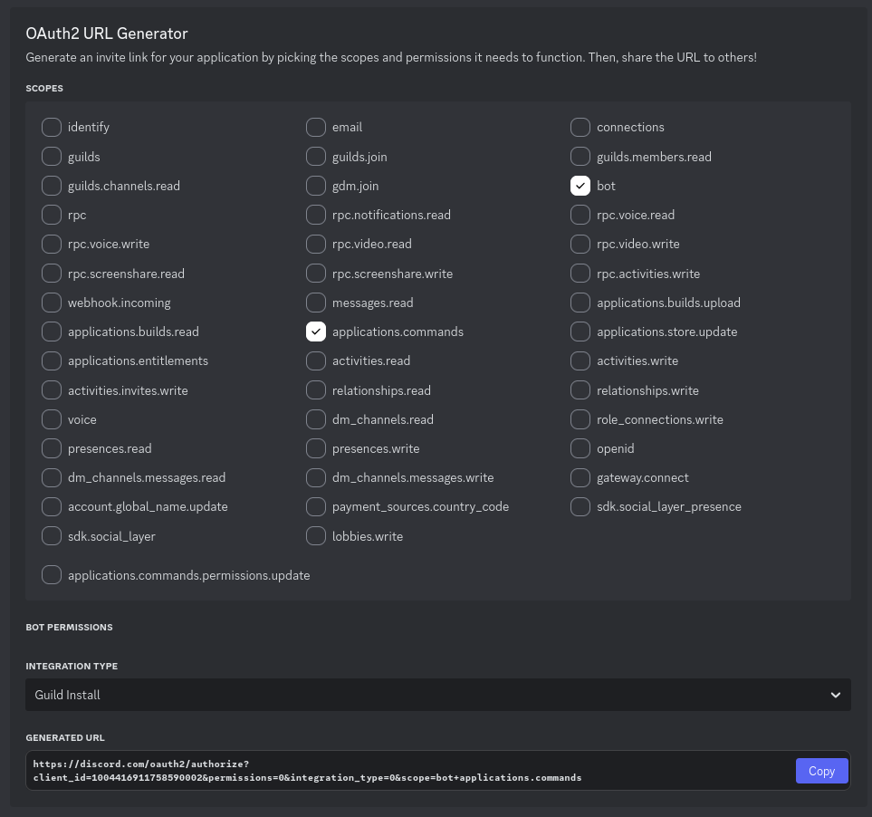

# Register a bot application

**1.** [Open the Discord developer portal](https://discord.com/developers/applications).

**2.** Create a new application in the top right corner.

**3.** Click add bot in the bot tab.

> [!CAUTION]
> **You must turn off public status in the bot tab.** If anyone can add the bot they can use commands on your bot through their own server which bypasses your permissions!
>
> 
>
> If someone else has added your bot to their server you can tell the bot to leave it using the `--leave` command line parameter (Use `--help` for more info).

**4.** Turn on all intents in the bot tab:

**5.** Generate an invite link in the OAuth2 tab with the following scopes (bot permissions do not matter in this step):

**6.** Invite the bot using the invite link generated at the bottom.
